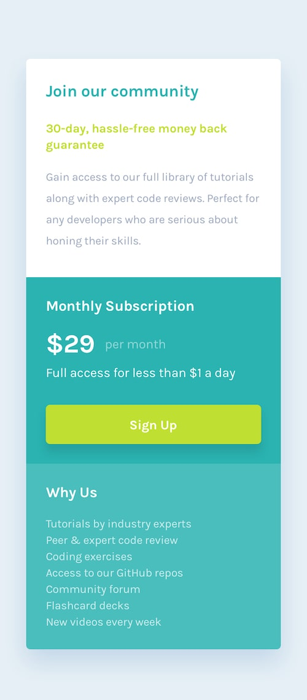

# Let's Practice Using HTML & CSS

Hey there! We've got a super cool repository that's gonna help you improve your HTML and CSS skills in a jiffy! This repository is packed with images of websites and web components that you can recreate using HTML and CSS. We've even thrown in an `index.html` and `styles.css` file to get you started! 

This hands-on practice will give you the confidence to take on any web development challenge that comes your way. So, what are you waiting for? Let's get coding and level up your web development skills!

## Let's Get Started

1. Fork this repository by clicking the _**fork**_ button on the top right of this github page.

1. Clone your forked version to your computer.

1. `cd` into the newly cloned folder then open with Visual Studio Code with `code .`

## Breaking Down Your Assets

Each practice folder contains the following file structure:

- `designs/` - These are images of the site or component you're trying to replicate. Some problems include active states as well.
- `images/` - Any images you'll need for the layouts are found in here. 
- `style-guide.md` - The style guide provides color codes, font links, and anything else you may need to help match the layout.
- `index.html` - All of your HTML should be contained in this file.
- `styles.css` - All of your CSS should be contained in this file. 

## Directions

In each practice folder, you'll find images of a website or web component that you'll be recreating using HTML and CSS. To ensure that your code is high-quality, here are a few guidelines:

1. Use semantic HTML tags to structure your code in a meaningful way. [HTML Semantics Guide](https://www.semrush.com/blog/semantic-html5-guide/)

1. Make use of CSS Grid to control the layout of your page. [CSS Grid Guide](https://css-tricks.com/snippets/css/complete-guide-grid/)

1. Use flexbox to help with centering and spacing content evenly. [CSS Flexbox Guide](https://css-tricks.com/snippets/css/a-guide-to-flexbox/)

1. Choose whether to start with a mobile-first or desktop-first approach, and stick with it throughout the problem. This will help you create a responsive design that works well across different screen sizes.

1. Use `@media` queries to make changes to your design as the screen size changes. 

1. Make sure to add alt tags to all of your images so that they're accessible to everyone.

## Responsiveness

Consider me your product owner. I've decided we're going to account for mobile, tablet, and desktop layouts. Here are your dimensions:

### Mobile First
- Mobile: `Default`
- Tablet: `>= 768px`
- Desktop: `>= 1280px`

### Desktop First
- Mobile: `<= 767px`
- Tablet: `<= 1279px`
- Desktop: `Default`

## Practice Problem 1: Product Preview Card Component

### Mobile Layout

### Desktop Layout

## Practice Problem 2: Three Column Card Component

### Mobile Layout

### Desktop Layout

## Practice Problem 3: Single Price Component

### Mobile Layout

### Desktop Layout

## Practice Problem 4: Testimonials Grid

### Mobile Layout

### Desktop Layout

## Practice Problem 5: News Site Homepage

### Mobile Layout

### Desktop Layout

## Attribution & More Practice!

[These practice problems were found on frontendmentor.io](https://www.frontendmentor.io)! 

Get in even more practice by signing up for an account and taking on additional challenges 💪