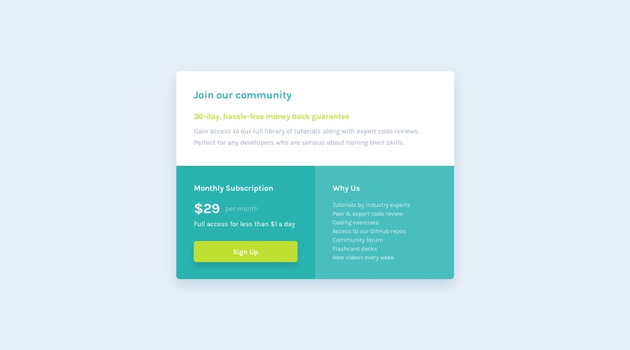

# Let's Practice Using HTML & CSS

This repo includes four folders aplty named `practice-layout-#` - each including an `index.html` and `styles.css` file for you to use, as well as images of the website or web component you're trying to create. 

## Let's Get Started

1. Fork this repository by clicking the _**fork**_ button on the top right of this github page.

1. Clone your forked version to your computer.

1. `cd` into the newly cloned folder then open with Visual Studio Code with `code .`

## Directions

Use your knowledge of HTML and CSS to build a website or web component that closely resembles the images provided in each practice folder.

Your code should adhere to a few rules:

1. Use semantic HTML tags. [Semantic HTML Guide](https://www.semrush.com/blog/semantic-html5-guide/)

1. Control your layout with the power of `CSS Grid`. [CSS Grid Guide](https://css-tricks.com/snippets/css/complete-guide-grid/)

1. Use `flexbox` to help with centering and spacing content evenly. [CSS Flexbox Guide](https://css-tricks.com/snippets/css/a-guide-to-flexbox/)

1. Choose to start mobile-first or desktop-first and stick with that concept for the entire problem.

1. Use `@media` queries to make changes across multiple screen sizes.

1. Keep `accessibility` in mind by making sure images have alt tags. 

## Responsiveness

Consider me your product owner. I've decided we're going to account for mobile, tablet, and desktop layouts. Here are your dimensions:

### Mobile First
- Mobile: `Default`
- Tablet: `>= 768px`
- Desktop: `>= 1280px`

### Desktop First
- Mobile: `<= 767px`
- Tablet: `<= 1279px`
- Desktop: `Default`

## Fonts

Do your best to match the fonts, but don't worry about being perfect. You can use [Google Fonts](https://fonts.google.com/) to add new web fonts to your page. 

## Practice Problem 1: Product Preview Card Component

### Mobile Layout

### Desktop Layout

## Practice Problem 2: Three Column Card Component

### Mobile Layout

### Desktop Layout

## Practice Problem 3: Single Price Component

### Mobile Layout

### Desktop Layout

## Practice Problem 4: Testimonials Grid

### Mobile Layout

### Desktop Layout

## Practice Problem 5: News Site Homepage

### Mobile Layout

### Desktop Layout

## Done!

Finished them all? [Checkout more frontend challenges on frontendmentor.io](https://www.frontendmentor.io)